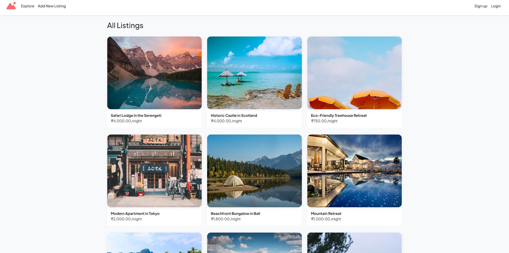
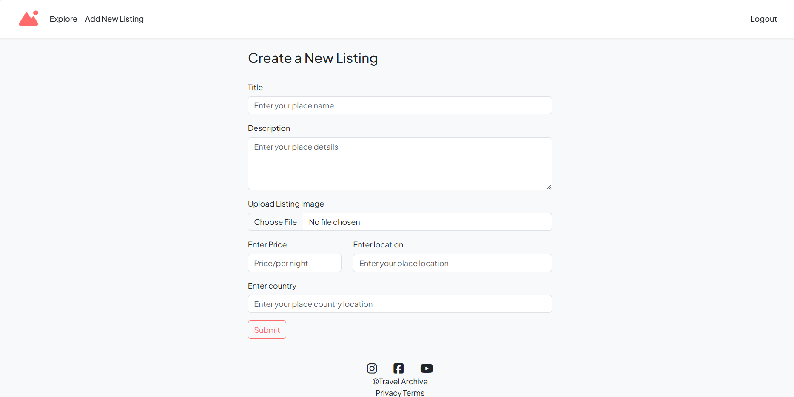
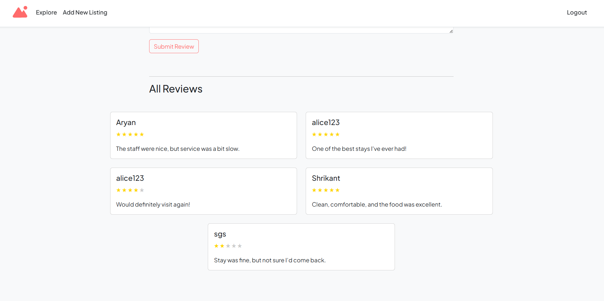

# 🌍 Travel Archive


A full-featured travel listing web app where users can explore global destinations, create and manage property listings, and review experiences. Inspired by platforms like Airbnb, this app supports image uploads, map integration, and user authentication — all wrapped in a beautiful, mobile-friendly interface.

---

## 📸 Screenshots

| Home Page | Listing Details | Reviews Section |
|-----------|------------------|------------------|
|  |  |  |


---

## 🎯 Features

- 📝 Add, edit, and delete travel listings
- 📍 Interactive map integration with Leaflet.js
- 🌐 Search listings by destination
- 🖼 Upload listing images via Cloudinary
- ⭐ Add, edit, and delete user reviews
- 🔐 Authentication (signup/login/logout) with Passport.js
- 💬 Flash messages for success and error notifications
- 🧾 Form validations with Joi
- 💻 Responsive and modern UI using Bootstrap 5

---

## 🧠 How It Works

1. **Browse listings** from all over the world.
2. **Search** by destination country.
3. **Sign up / Log in** to add your own listings.
4. Add details like **title, description, location, price**, and an **image**.
5. View listings on a **live map**.
6. Leave **reviews and ratings** for listings.
7. Edit or delete your listings and reviews.

---

## 📁 Project Structure

```plaintext
root/
├── models/                 # Mongoose models (Listing, Review, User)
├── routes/                 # Express route handlers
├── controllers/            # Logic for listings, users, and reviews
├── middleware/             # Custom auth and validation middlewares
├── public/                 # Static files (CSS, JS, Assets)
├── views/                  # EJS templates (pages and partials)
├── schemas/                # Joi validation schemas
├── utils/                  # Utility functions
├── cloudConfig.js          # Cloudinary config
├── app.js                  # Main server file
└── README.md               # You are here

```

---

## 📦 Tech Stack

| Technology      | Purpose                                 |
|----------------|------------------------------------------|
| Node.js + Express | Backend server & routing               |
| MongoDB + Mongoose | Database & ODM                        |
| EJS              | Templating engine                       |
| Passport.js      | User authentication                    |
| Joi              | Request validation                     |
| Cloudinary       | Image uploads and hosting              |
| Leaflet.js       | Map rendering                          |
| Bootstrap 5      | Responsive UI design                   |
| Multer           | File handling for uploads              |
| Method Override  | Supporting PUT/DELETE in forms         |

---

## 🙌 Acknowledgements

- 🏠 **UI inspired by:** [Airbnb](https://airbnb.com)  
- 🗺️ **Maps powered by:** [Leaflet.js](https://leafletjs.com/)  
- ☁️ **Images hosted via:** [Cloudinary](https://cloudinary.com)  

---

## 👤 Author

**Satyam Gangwar**  

[](https://www.linkedin.com/in/satyamgangwar/)
[](mailto:gangwar.satyam01@gmail.com)
